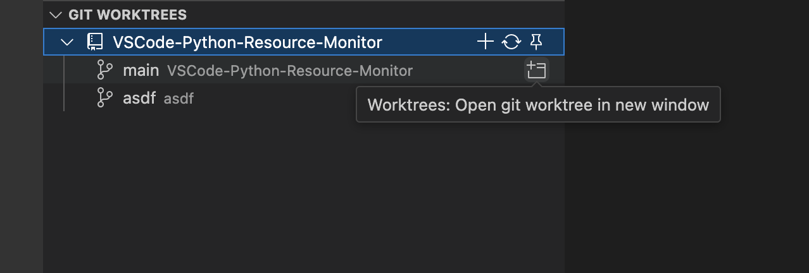

# Git Worktrees for Visual Studio Code

This extension adds [Git Worktree](https://git-scm.com/docs/git-worktree) tools which are otherwise not present in the default Git extension.

## Features

Create, open, and delete Git worktrees with ease! This extension provides an interface to switch between your worktrees quickly from the source control tab, smoothly integrating with the existing Git functionality in VS Code.

Additionally, you can pin Git repositories so they will always be available in the Git Worktrees view, even if you switch to another project!
- The git fetch button allows you to fetch a repository from remotes, so you can create a worktree on that new remote branch without having to open the repository first.

## Requirements

This extension only requires the Git extension, which comes pre-packaged with VS Code!

## Release Notes

### 0.0.2

- Fixed a bug that would not load repositories if the Git extension was faster than this one (in production this is always the case since Git is a prerequisite)
- The remove all pins command actually exists now

### 0.0.1

Initial release :D
